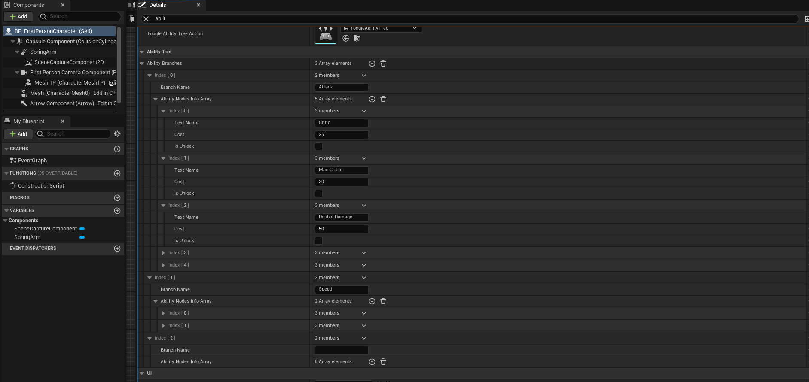

# UTAD-UI-FPS-Public
 
/***********************************Player HUD*****************************************************/
Todos los widgets que se agregan a la pantalla principal (PlayerHud) implementan la interfaz VisibilityInterface, que define dos métodos: Show y Hide. 
Esto simplifica considerablemente el código, permitiendo una gestión más limpia y ordenada de los elementos de interfaz durante el desarrollo del proyecto.

Cada widget se suscribe a los delegados necesarios para actualizar su información en tiempo real o para responder a eventos específicos. 
Por ejemplo, el widget PlayerHealthBar está vinculado al delegado OnHealthChanged de la clase AUTAD_UI_FPSCharacter.
Cuando la salud máxima o la salud actual del jugador cambia, el método suscrito UpdateEnemyHealthBar se invoca automáticamente para actualizar la barra de salud.

Este mismo delegado es reutilizado para el marcador de daño en pantalla (PlayerHitMarker), brindando retroalimentación visual cuando el jugador recibe daño.

Otros Widgets: Contador de Munición y Crosshair
AmmoCounter: Utiliza los métodos UpdateCurrentAmmo y UpdateMaxCurrentAmmo para reflejar en tiempo real la cantidad de munición actual y máxima.
Crosshair: Utiliza los eventos OnShoot y DetectEnemy. Este último recibe un booleano para determinar si el crosshair se encuentra sobre un enemigo, 
lo que permite cambiar dinámicamente su apariencia cuando se dispara o se detecta un enemigo.

/***********************************Pantallas*****************************************************/
El controlador del jugador (Player Controller) gestiona las pantallas activas, decidiendo si mostrar el HUD del jugador, el árbol de habilidades o, al inicio de la partida, la SplashScreen.

/--SplashScreen--/
El widget SplashWidget cuenta con el método _EnableSplashScreen_, que inicia una animación vinculada (usando Blueprints con BindWidgets). 
Este método recibe un FWidgetAnimationDynamicEvent y se suscribe al evento AnimationFinished. Una vez que la animación termina, se llama al método _DisableSplashScreen_ 
en el controlador del jugador para ocultar la pantalla y restaurar el control de entrada.

/--Árbol de Habilidades--/
El árbol de habilidades está diseñado para ser modular y escalable, permitiendo que se expanda fácilmente con nuevas habilidades o ramas. Su estructura principal incluye tres clases de interfaz:

UAbilityTreeHUD: Es la pantalla que se muestra al presionar el botón "P". Contiene las ramas de habilidades, cada una de las cuales tiene sus propios nodos de habilidades. La información para construir el árbol está almacenada en el jugador y puede modificarse tanto en el editor como durante el juego. El método _AddBranch_ permite agregar ramas al árbol utilizando la información almacenada en el jugador. La estructura del árbol se genera a través del método _ReadfromStructInfo_. Esta clase también contiene una referencia a las monedas del jugador, que se usan para comprar habilidades.

UAbilityBranch: Esta clase almacena una lista de nodos de habilidades y gestiona su disposición visual. También añade un separador entre cada nodo y ajusta los paddings.

UAbilityNode: Cada nodo representa una habilidad específica, mostrando su información en pantalla. Esta clase también incluye los métodos necesarios para intentar comprar una habilidad, con feedback visual que indica si la compra fue exitosa.

Además, para dar retroalimentación adicional al jugador, se utiliza una clase de mensajes, UMessageWidget, que pertenece a UAbilityTreeHUD. Este widget muestra mensajes informativos en la esquina superior derecha de la pantalla cuando es necesario, brindando al jugador información clara y rápida sobre sus acciones en el árbol de habilidades.

